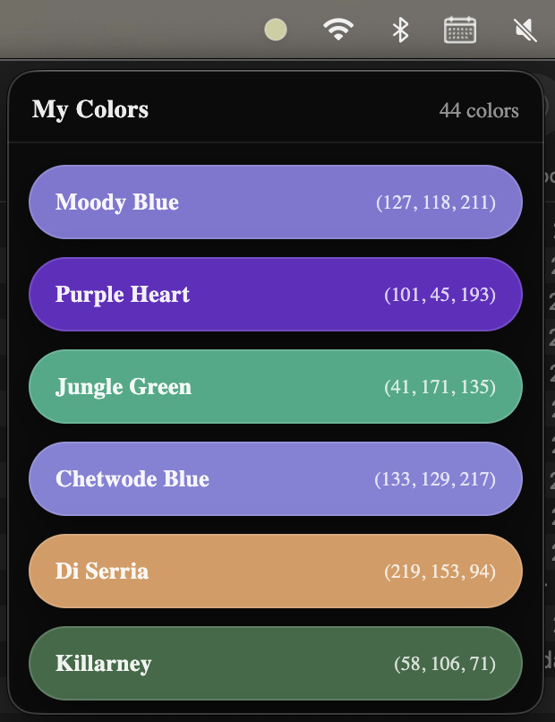
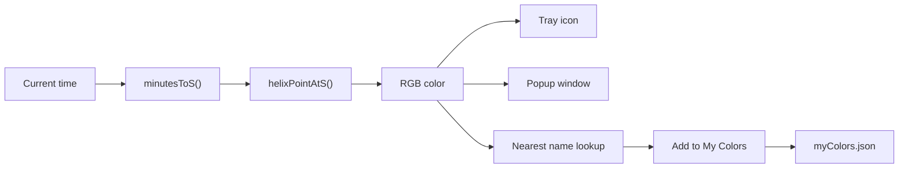

# ColorTime

<p align="center">
  <strong>A tiny menubar clock that renders the day as color.</strong><br />
  Time does not have to look like numbers.
</p>

<p align="center">
  
  
  
  
  
</p>

<p align="center">
  
</p>

## Color, Flowing

> Most clocks tell you the hour.
>
> ColorTime tries to give the hour a mood.

ColorTime is a lightweight desktop utility that lives in the tray and turns the current time into a live RGB color. Open the app and you get the current color, its closest human-readable name, and exact RGB/HEX values. If you find a color you want to keep, you can save it into a small personal palette called **My Colors**.

It is part clock, part ambient interface, and part color experiment.

## Overview

At the center of the app is a simple idea: the day can be treated like a path through color space instead of a march through digits.

ColorTime maps the current moment onto a controlled helix inside the RGB cube. That gives the app a smooth color journey across the day while keeping every color inside a safe, displayable range. The result updates every second in the tray icon and in the popup window.

Along the way, the app also finds the closest named color from the large lookup table in [`src/colors/ColorList.ts`](src/colors/ColorList.ts), so the experience feels less like reading raw values and more like discovering real color identities.

## Highlights

- Live tray icon that updates every second to match the current time color.
- Frameless popup window with the nearest named color plus RGB and HEX readouts.
- Persistent **My Colors** view for saving favorite colors encountered during the day.
- Dynamic tray assets generated in code instead of relying on a full sprite set.
- Lightweight React renderer with Electron handling timing, persistence, and tray behavior.
- macOS-first menubar experience, with packaging scripts aimed at DMG and Mac App Store builds.

## How It Works

ColorTime computes the current color in three stages:

1. The current time is converted into minutes since midnight.
2. Those minutes are mapped onto a parameter `s` that travels along a 3D path over a full day.
3. That path is sampled inside RGB space to produce the final `r`, `g`, and `b` values.

The path itself is not random. It is a helix wrapped around the RGB diagonal, which means:

- noon and midnight land in very different tonal neighborhoods
- the color changes smoothly over time instead of jumping
- the path stays safely inside the RGB cube
- the palette has variety without turning into visual noise

The current implementation lives in [`electron/tray/colorOfDay.cjs`](electron/tray/colorOfDay.cjs), where `HELIX_CONFIG` controls the shape of the full-day color journey.



## User Experience

### Current Color

The main popup is intentionally minimal. It shows:

- the closest named color
- the exact RGB tuple
- the HEX value
- the live background color itself, filling the entire window

That screen is rendered by [`src/ts/ColorScreen.tsx`](src/ts/ColorScreen.tsx).

### My Colors

When you see a color you like, you can save it directly from the tray menu. The saved list appears in a separate frameless window with colored pills and compact RGB labels.

That view is rendered by [`src/ts/MyColorsScreen.tsx`](src/ts/MyColorsScreen.tsx), while persistence is handled in [`electron/tray/menubar.cjs`](electron/tray/menubar.cjs).

Saved colors are written to the Electron `userData` directory as `myColors.json`, so they persist across launches without requiring a database.

## Tech Stack

- Electron for the tray app, windows, IPC, and desktop packaging
- React for the renderer UI
- TypeScript for the frontend code
- Vite for development and production bundling
- `jiti` for loading the TypeScript color map from the Electron side
- `pngjs` and Electron `nativeImage` utilities for generating tray artwork

## Project Structure

```text
.
├── electron/
│   ├── main.cjs
│   ├── preload.cjs
│   ├── tray/
│   │   ├── colorOfDay.cjs
│   │   ├── menubar.cjs
│   │   ├── myColorsWindow.cjs
│   │   └── trayIcon.cjs
├── src/
│   ├── colors/ColorList.ts
│   ├── config/
│   ├── css/
│   └── ts/
├── python/
│   └── scripts/
└── package.json
```

## Getting Started

### Prerequisites

- Node.js 20+ is recommended
- npm
- macOS for the intended tray/menubar experience

### Install

```bash
npm install
```

### Run In Development

```bash
npm run dev
```

This starts Vite and Electron together. In development, Electron loads the Vite dev server and opens the tray app from there.

### Build The Frontend

```bash
npm run build
```

### Lint

```bash
npm run lint
```

## Packaging

ColorTime is currently configured primarily for macOS packaging.

```bash
npm run dist
```

Builds the app and creates a macOS DMG while bumping the patch version locally without creating a git tag.

Other package scripts:

- `npm run dist:dir` builds an unpacked macOS app directory
- `npm run dist:mas` builds the Mac App Store target

The Electron Builder configuration lives in [`package.json`](package.json).

## Customization

If you want to change the character of the app, these are the main places to start:

- [`electron/tray/colorOfDay.cjs`](electron/tray/colorOfDay.cjs)
  Tune the helix by changing `start`, `end`, `turnsEach`, `rMax`, `theta0`, and related values in `HELIX_CONFIG`.
- [`src/colors/ColorList.ts`](src/colors/ColorList.ts)
  Expand or replace the name-to-RGB lookup table that powers nearest-name matching and saved colors.
- [`src/css/ColorScreen.css`](src/css/ColorScreen.css)
  Adjust the main popup presentation.
- [`src/css/MyColorsScreen.css`](src/css/MyColorsScreen.css)
  Restyle the saved-colors window.

## Python Experiments

The `python/scripts/` folder contains exploratory scripts used to experiment with RGB-space paths and helix behavior.

- [`python/scripts/rgb_helix1.py`](python/scripts/rgb_helix1.py) explores the helix path and color naming in 3D space.
- [`python/scripts/rgb_simpleRGB.py`](python/scripts/rgb_simpleRGB.py) explores an alternative rounded path through RGB.

These scripts are not required to run the app itself, but they are useful if you want to evolve the color model.

## Screenshot Placement

I cannot reliably generate a polished tray-app screenshot from this workspace alone, so the README is set up to use one image supplied by you.

When you are ready, put your screenshot here:

```text
docs/images/colortime-screenshot.png
```

The README now references that file directly near the top.

The screenshot you posted is a good fit for the README hero because it shows the app's strongest visual surface clearly.

## License

ColorTime is released under the [MIT License](LICENSE.md).
